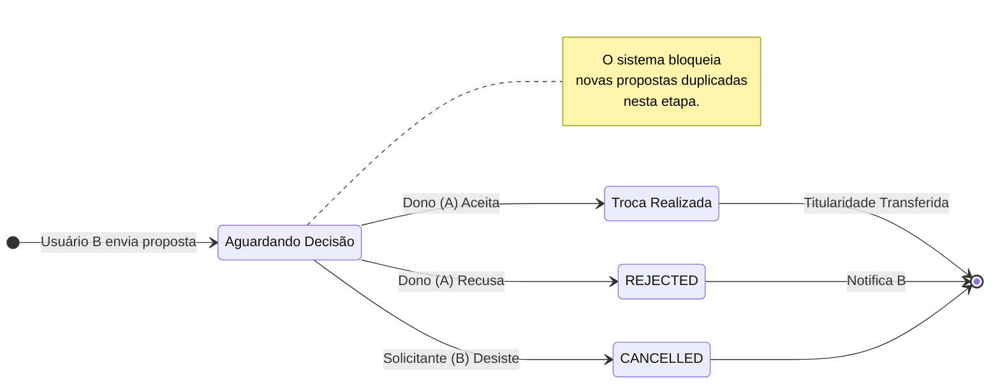
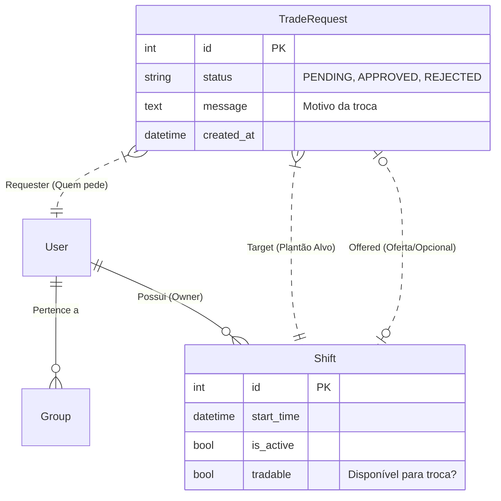
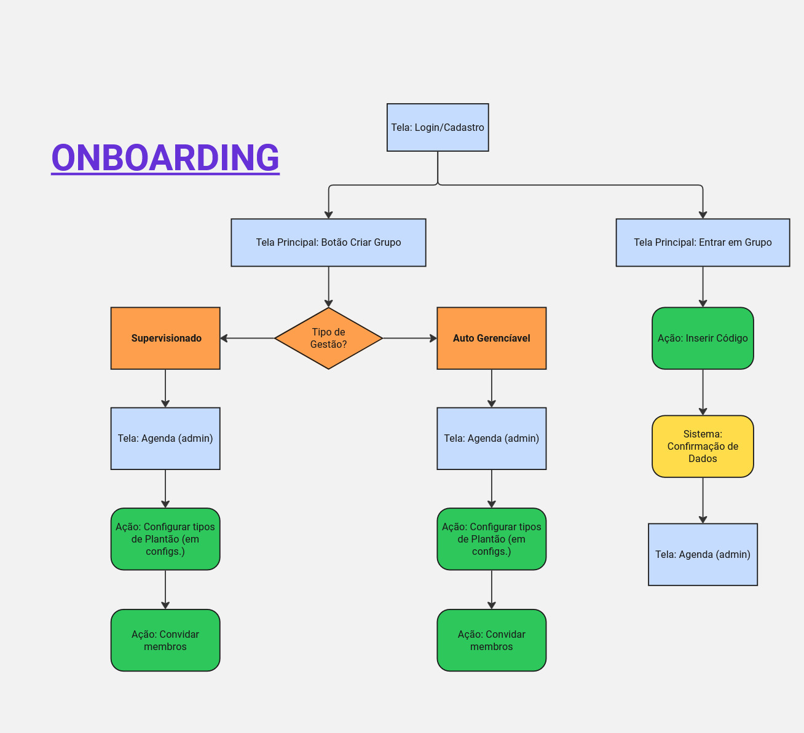
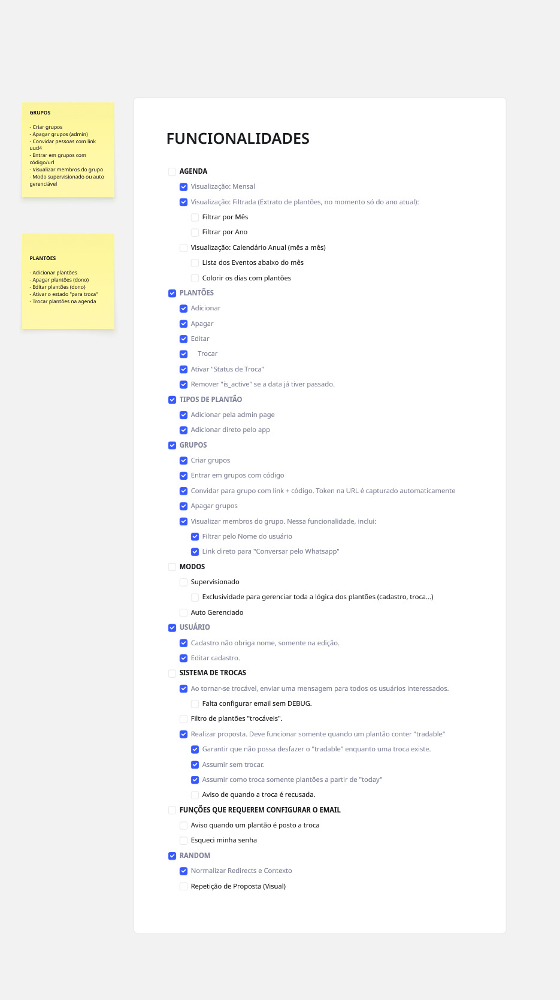
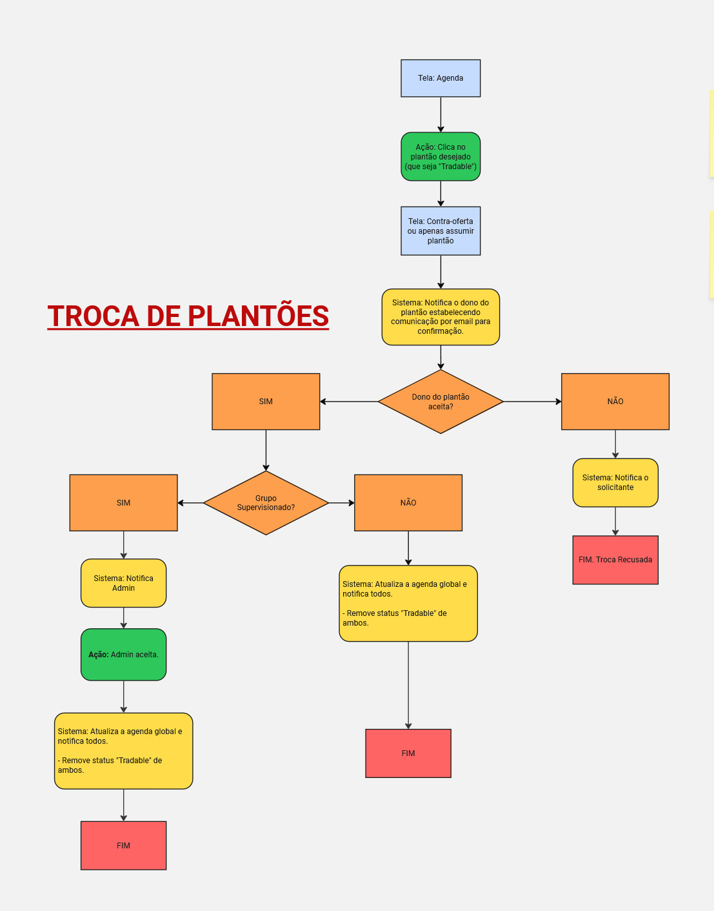

# 🏥 OnCall - Sistema de Gestão de Escalas

> **🚧 Status do Projeto:** Em desenvolvimento ativo (MVP funcional).


## 🎯 O Desafio

A gestão de escalas é um problema complexo. Planilhas quebradas, mensagens perdidas no WhatsApp e a confusão na hora de trocar um plantão são dores comuns em equipes médicas e de enfermagem.

O **OnCall** é uma aplicação web para resolver esse caos, garantindo que ninguém falte por falha de comunicação e que a gestão saiba exatamente quem está de plantão.

## 💡 A Solução

Desenvolvi uma plataforma centralizada, onde o diferencial não é apenas mostrar a agenda, mas permitir que os próprios profissionais **negociem suas trocas** de forma autônoma e segura.

O sistema cuida da burocracia: valida horários, impede conflitos e notifica os envolvidos, garantindo que a escala oficial esteja sempre atualizada sem depender de intervenção manual constante.

---

### 🤖 Nota sobre o Desenvolvimento

Como o foco deste projeto é **Engenharia de Backend** (Python/Django) e a complexidade das regras de negócio, utilizei ferramentas de **IA Generativa** para acelerar a prototipagem e estilização do Frontend. Isso me permite dedicar mais tempo à arquitetura do banco de dados, testes automatizados e segurança das transações.

## ✨ Funcionalidades Principais

### 📅 Agenda Inteligente

- **Visão Mensal & Anual:** Calendários intuitivos com indicadores visuais de status.
- **Extrato Pessoal:** Um filtro rápido para o profissional ver "quando eu trabalho?" sem se perder na escala geral.
- **Histórico:** Navegação fluida entre meses e anos passados ou futuros.

### 🔄 Sistema de Trocas (Trade System)

O coração do projeto. Um fluxo transacional atômico para gerenciar substituições:

- **Oferta de Plantão:** O usuário sinaliza: _"Posso trocar este dia"_.
- **Propostas Flexíveis:** Outros colegas podem oferecer:
  - _"Assumo seu plantão"_ (Doação).
  - _"Troco pelo meu dia X"_ (Permuta/Swap).
- **Validação Automática:** O sistema barra propostas duplicadas ou inválidas antes mesmo de incomodar o dono do plantão.
- **Troca Segura:** Quando o aceite ocorre, o banco de dados transfere a titularidade instantaneamente.

### 👥 Gestão de Equipes

- **Onboarding sem Fricção:** Convites via Link Único (Hash) ou Código de Acesso, facilitando a entrada de novos médicos no grupo.
- **Tipos Personalizáveis:** Suporte para diferentes dinâmicas (Noturno, Diurno, Sobreaviso...).

## 🛠️ Arquitetura e Fluxos

### O Ciclo de Vida de uma Troca

Este diagrama ilustra como o sistema gerencia os estados de uma solicitação, desde a proposta até a efetivação no banco de dados.



### Modelagem de Dados (Core)

Estrutura relacional simplificada mostrando como as solicitações de troca conectam usuários e turnos.



## 🧠 Planejamento Focado

A robustez do **OnCall** vem de um planejamento detalhado pré-codificação. Utilizei ferramentas visuais para mapear tanto a estrutura de dados quanto a jornada do usuário, garantindo que o backend suportasse todas as regras de negócio necessárias.

<details>
  <summary><strong>Ver Fluxos de Interface (Clique para expandir)</strong></summary>

  <br>

**Onboarding e Entrada nos Grupos**

> Fluxo de convite via token e criação de conta.
> 

**Painel de Funcionalidades (Dashboard)**

> Visão geral das funcionalidades acessíveis ao usuário logado.
> 

**Fluxo de Troca de Plantões**

> A lógica visual da proposta, validação e aceite de trocas.
> 

</details>

## 🏗️ Infraestrutura e DevOps

O projeto evoluiu de uma execução local simples para uma arquitetura containerizada, visando paridade entre ambientes de desenvolvimento e produção.

- **Docker Compose:** Orquestração de serviços (App + Banco).
- **PostgreSQL:** Substituição do SQLite para suportar concorrência e tipos de dados complexos.

## 🚀 Como Rodar o Projeto

Você pode rodar a aplicação de duas formas: utilizando **Docker** (recomendado, pois inclui o Banco de Dados PostgreSQL configurado) ou **Manualmente** (com SQLite).

### Pré-requisitos

- [Git](https://git-scm.com/)
- [Docker Desktop](https://www.docker.com/products/docker-desktop/) (Para rodar com Docker)
- [Python 3.10+](https://www.python.org/) (Apenas se for rodar manualmente)

---

### 🐳 Via Docker (Recomendado)

Esta opção sobe a aplicação Django e um banco PostgreSQL 15 em containers isolados.

1. Clone o repositório:

   ```bash
   git clone https://github.com/pazaborgs/OnCall
   cd OnCall
   ```

2. Configure as Variáveis de Ambiente: Duplique o arquivo de exemplo para criar o seu .env oficial:

```bash
cp dotenv_files/.env.example dotenv_files/.env
```

O arquivo já vem configurado para conectar ao banco do Docker.

3. Suba o ambiente:

```bash
docker compose up --build
```

_Aguarde até ver a mensagem "Starting development server at https://www.google.com/search?q=http://0.0.0.0:8000/"_

4. Crie um Superusuário: Com o terminal anterior rodando, abra uma nova janela do terminal e digite:

```bash
docker compose exec djangoapp python manage.py createsuperuser
```

Acesse: http://127.0.0.1:8000

### 🐍 Manualmente (Local com SQLite)

1. **Clone o repositório**

```bash
git clone https://github.com/pazaborgs/OnCall
cd OnCall
```

2. **Crie e ative o ambiente virtual**

```bash
# Windows
python -m venv .venv
.venv\Scripts\activate

# Linux/Mac
python3 -m venv .venv
source .venv/bin/activate
```

3. **Instale as dependências**

```bash
pip install -r requirements.txt
```

4. **Configure as Variáveis**
   Crie o arquivo `dotenv_files/.env`.

Importante: Se você copiou o exemplo do Docker, coloque uma `#` na frente da linha do banco de dados para desativá-la:

```env
# DATABASE_URL=postgres://... (Comente esta linha para usar SQLite)
DEBUG=True
SECRET_KEY=sua_chave_secreta_local
```

5. **Prepare o Banco de Dados**

```bash
python manage.py migrate
python manage.py createsuperuser # Crie seu admin
```

6. **Rode a Aplicação**

```bash
python manage.py runserver
```

Acesse: `http://127.0.0.1:8000`

## 🧪 Qualidade de Código

O projeto conta com uma suíte de testes automatizados focada nas regras de negócio críticas (trocas e permissões).

```bash
python manage.py test shifts
```

## 📝 Roadmap (Próximos Passos)

- [x] **MVP:** Gestão de Plantões e Trocas Básicas.
- [x] **Testes Automatizados.**
- [x] **Email usando App Passwords do Google:** Enviando emails através do Google.
- [x] **Docker e PostgreSQL:** Ambiente containerizado configurado via Docker Compose.
- [ ] **Visualização Anual:** Grid de calendário anual para planejamento de longo prazo.
- [ ] **Modo Supervisionado:** Fluxo onde a troca requer aprovação final de um "Chefe de Equipe".

---

👉🏽 Autor do Código: [Patrick Regis](https://www.linkedin.com/in/patrickrgsanjos)
